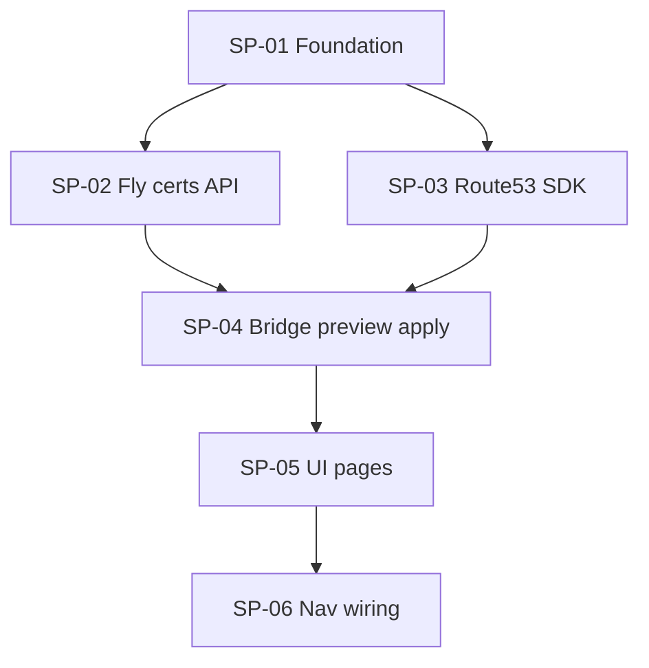

# Plan: Fly custom domains → Route 53

## Outcome

An AWS-section tool under **Route 53** that lists Fly.io apps, highlights those with **pending or failed** custom domain verification, and lets operators **preview then apply** required DNS records to Route 53 hosted zones (public or private auto-match).

Parent nav: `/route53` (minimal hub). Tool: `/route53/fly-domains`.

## Global contracts

Single source of truth: [contracts.md](./contracts.md).

Grilling session pinned: types split (`lib/domains/types.ts` vs `lib/fly/types.ts`), hash-based apply confirm, TTL from Fly JSON (default 300), table + sticky filters, pending/failed badge split, sequential UI after bridge.

## Dependency graph



## Sub-plans

| Id | Title | Type | Blocked by | Owns (summary) |
|----|-------|------|------------|----------------|
| SP-01 | Foundation | Foundation | — | `contracts.md`, `lib/domains/types.ts`, `package.json` dep |
| SP-02 | Fly certs API | Parallel | SP-01 | `lib/fly/types.ts`, `lib/fly/cli.ts`, `/api/fly/domains`, cert detail route |
| SP-03 | Route 53 SDK | Parallel | SP-01 | `lib/aws/route53.ts`, `/api/route53/hosted-zones` |
| SP-04 | Bridge preview/apply | Parallel | SP-02, SP-03 | `lib/domains/fly-route53.ts`, preview + apply API |
| SP-05 | UI dashboard | Parallel | SP-04 | `/route53` hub, `/route53/fly-domains`, `components/route53/*` |
| SP-06 | Nav wiring | Integration | SP-05 | registry, overview-directory, shell, sidebar, CODEBASE |

## Suggested execution

1. **Merge SP-01** — contracts + shared domain types + SDK dependency.
2. **Spawn SP-02 and SP-03 in parallel** — Fly inventory API and Route 53 hosted zones.
3. **Merge SP-04** — bridge parser, preview hash, apply with 409 on drift.
4. **Merge SP-05** — table UI, sticky filters, preview modal, minimal `/route53` hub.
5. **Merge SP-06** — AWS nav parent/child, topbar selectors, docs, `tsc` + lint + graphify.

## Verification (after SP-06)

```bash
npx tsc --noEmit
npm run lint
graphify auto-update .
```

Manual: `fly auth login`, AWS profile in Settings, pending app highlighted, preview → apply → Route 53 records created.

## Source plan

Cursor plan: `.cursor/plans/fly_route53_domains_87435ead.plan.md`
